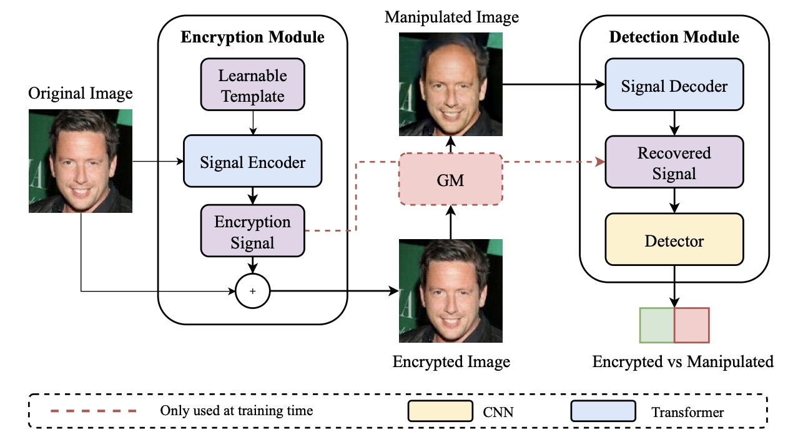

<h1 align="center">Image Specific Protection Against Manipulation (ICIAP2025)</h1> 
 <p align="center">
    <a href='https://www.unibo.it/sitoweb/filippo.bartolucci3/en' target='_blank'>Filippo Bartolucci</a>&emsp;
    <a href='https://www.unibo.it/sitoweb/giuseppe.lisanti/en' target='_blank'>Giuseppe Lisanti</a>&emsp;
    <br>
    Computer Vision Lab, University of Bologna, Italy
 </p>
 
 <p align="center">
 <a href="https://link.springer.com/chapter/10.1007/978-3-032-10185-3_52" target='_**blank**'>
    
  </a>
 </p>

<p align="center">
 
</p>

This work introduces a proactive defense framework to safeguard images against manipulations performed by Generative Models (GMs). Unlike traditional passive detection methods, which attempt to identify manipulations after they occur, our approach embeds image-specific protection signals directly into the image before sharing it.

# Checkpoints
You can download the pretrained checkpoints from the link below:
 * [Checkpoints](https://drive.google.com/file/d/1Xs_0sDi7BGUogeuZFilhtJNx5RrFgM0Y/view?usp=share_link)

# Dataset
We rely on the test set split used in MaLP.
Please download the dataset directly from their repository:
* [MaLP Repository](https://github.com/vishal3477/pro_loc)

# Cite
If you find our work helpful, please consider starring this repo 🌟 and cite:

**Image Specific Protection Against Manipulation**
```
@inproceedings{bartolucci2025image,
  title={Image Specific Protection Against Manipulation},
  author={Bartolucci, Filippo and Lisanti, Giuseppe},
  booktitle={International Conference on Image Analysis and Processing},
  pages={660--671},
  year={2025},
  organization={Springer}
}
```

**[Perturb, Attend, Detect and Localize (PADL): Robust Proactive Image Defense](https://github.com/filippobartolucci/PADL)**
```
@ARTICLE{10980274,
  author={Bartolucci, Filippo and Masi, Iacopo and Lisanti, Giuseppe},
  journal={IEEE Access}, 
  title={Perturb, Attend, Detect, and Localize (PADL): Robust Proactive Image Defense}, 
  year={2025},
  volume={13},
  pages={81755-81768},
  doi={10.1109/ACCESS.2025.3565824}}

```

